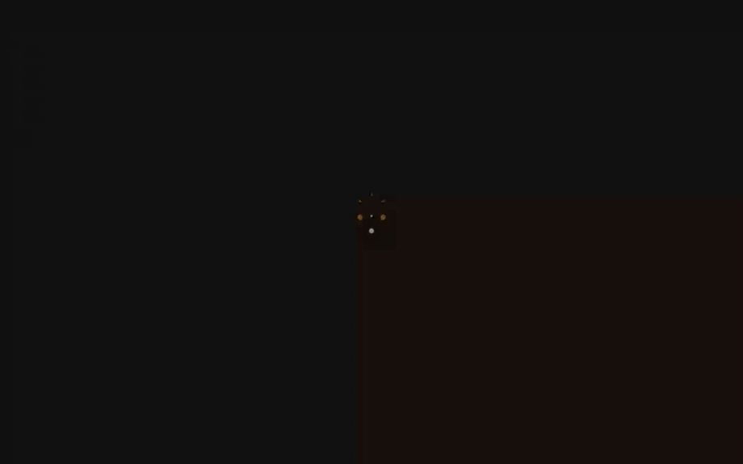
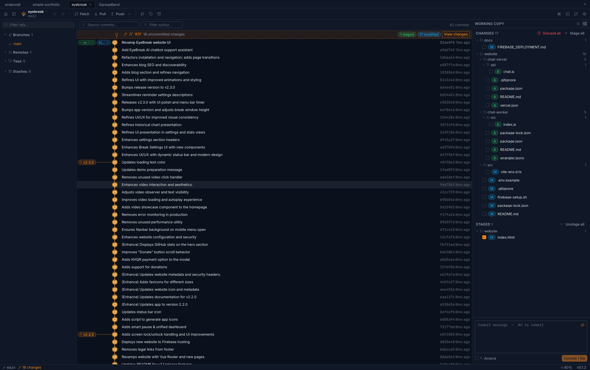
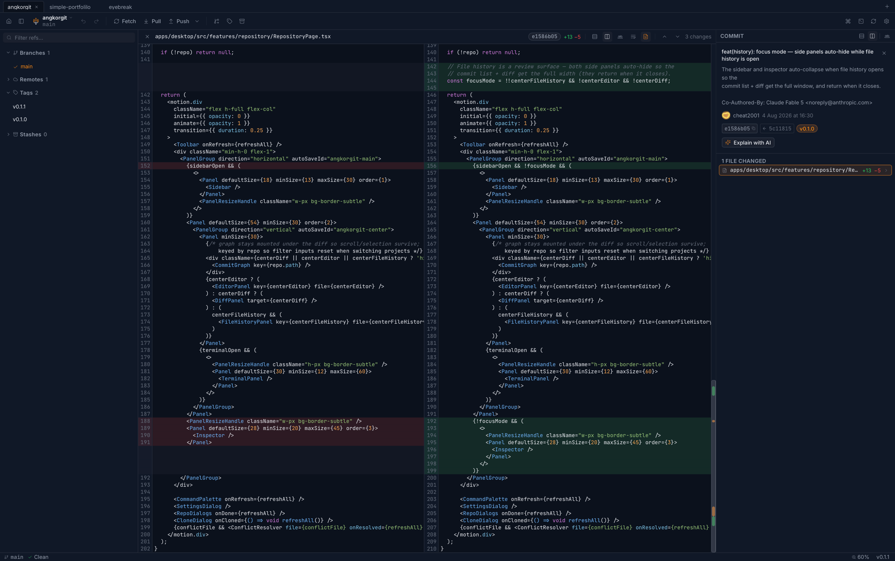
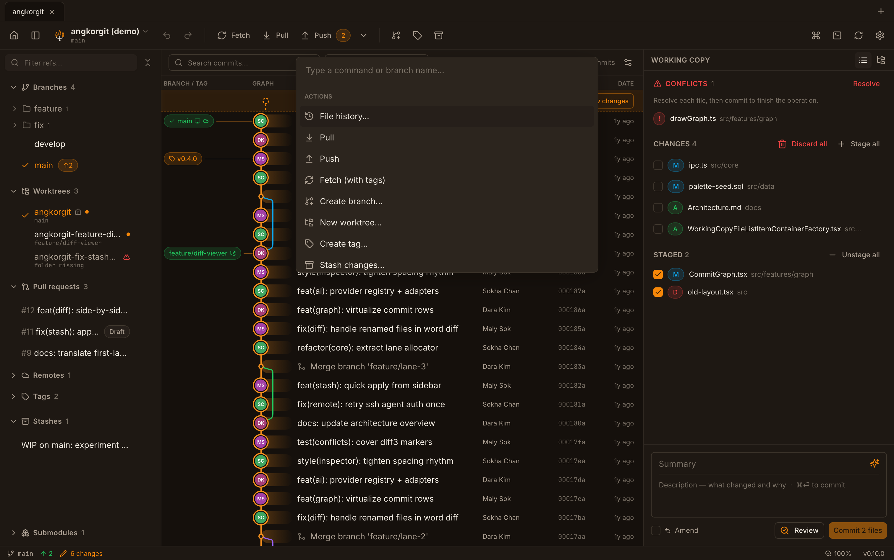
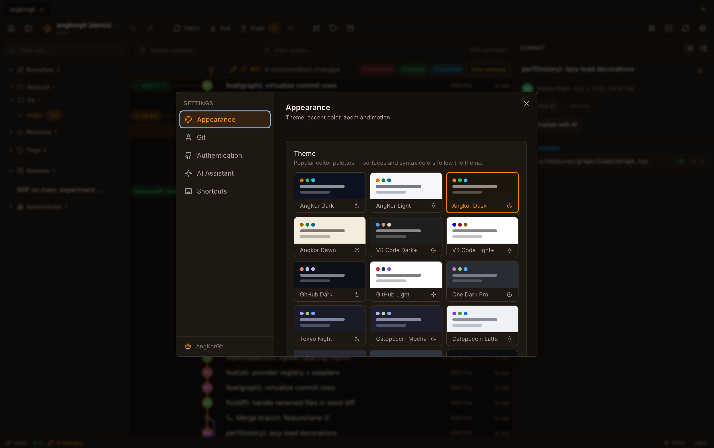
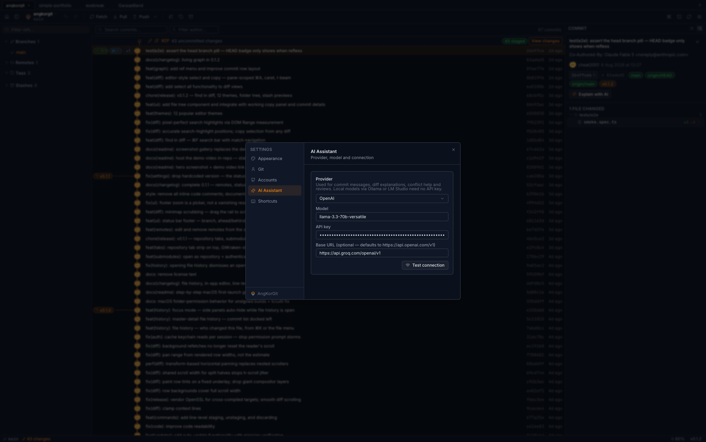
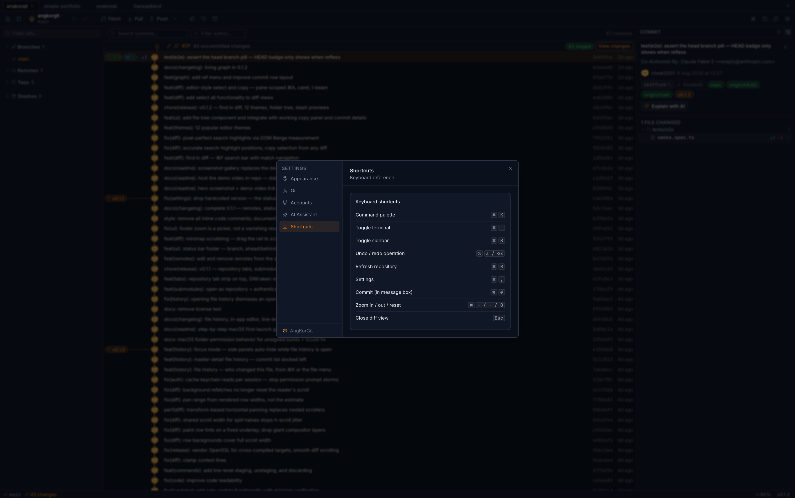
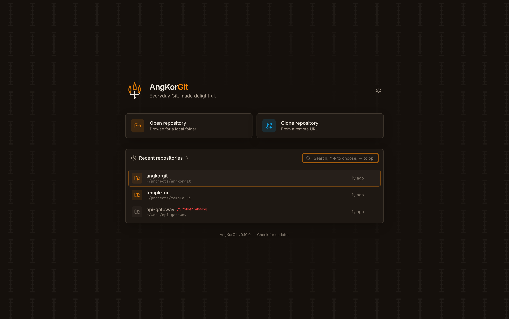

<p align="center">
  
</p>

<h1 align="center">AngKorGit</h1>

<p align="center">
  A modern, fast, beautiful cross-platform Git client.<br/>
  Inspired by Angkor Wat — strength, simplicity, and craftsmanship from Cambodia. 🇰🇭
</p>

<p align="center">
  <a href="https://github.com/cheat2001/angkorgit/actions/workflows/ci.yml"></a>
  <a href="LICENSE"></a>
  
  
  <a href="https://angkorgit.app/"></a>
</p>

---

<p align="center">
  
</p>

<p align="center">
  <picture>
    <source media="(prefers-color-scheme: dark)" srcset="docs/assets/graph.png" />
    <source media="(prefers-color-scheme: light)" srcset="docs/assets/graph-light.png" />
    
  </picture>
</p>

AngKorGit focuses on the Git operations developers use every day and executes them exceptionally well — in an app that weighs **12 MB to download** (25 MB installed, universal macOS build) instead of a gigabyte.

<table>
  <tr>
    <td width="50%">
      <picture>
        <source media="(prefers-color-scheme: dark)" srcset="docs/assets/diff.png" />
        <source media="(prefers-color-scheme: light)" srcset="docs/assets/diff-light.png" />
        
      </picture>
      <p align="center"><em>Side-by-side diffs — word-level highlights, minimap, line-level staging</em></p>
    </td>
    <td width="50%">
      <picture>
        <source media="(prefers-color-scheme: dark)" srcset="docs/assets/command-palette.png" />
        <source media="(prefers-color-scheme: light)" srcset="docs/assets/command-palette-light.png" />
        
      </picture>
      <p align="center"><em>The ⌘K command palette — every action searchable, keyboard-first by design</em></p>
    </td>
  </tr>
  <tr>
    <td width="50%">
      <picture>
        <source media="(prefers-color-scheme: dark)" srcset="docs/assets/theme-setting.png" />
        <source media="(prefers-color-scheme: light)" srcset="docs/assets/theme-setting-light.png" />
        
      </picture>
      <p align="center"><em>Sixteen themes, five accent colors, and UI zoom — all in one settings tab</em></p>
    </td>
    <td width="50%">
      <picture>
        <source media="(prefers-color-scheme: dark)" srcset="docs/assets/ai-config-setting.png" />
        <source media="(prefers-color-scheme: light)" srcset="docs/assets/ai-config-setting-light.png" />
        
      </picture>
      <p align="center"><em>AI settings — bring your own provider, or use an AI CLI you already have with no API key at all</em></p>
    </td>
  </tr>
  <tr>
    <td width="50%">
      <picture>
        <source media="(prefers-color-scheme: dark)" srcset="docs/assets/shortcut-key.png" />
        <source media="(prefers-color-scheme: light)" srcset="docs/assets/shortcut-key-light.png" />
        
      </picture>
      <p align="center"><em>Shortcuts render next to every action — the full keyboard reference lives in settings</em></p>
    </td>
    <td width="50%">
      <picture>
        <source media="(prefers-color-scheme: dark)" srcset="docs/assets/welcome.png" />
        <source media="(prefers-color-scheme: light)" srcset="docs/assets/welcome-light.png" />
        
      </picture>
      <p align="center"><em>Open, clone, or return to recent projects</em></p>
    </td>
  </tr>
</table>

## Highlights

- **Fast by architecture** — Rust + libgit2 engine, virtualized graph *and* diff rendering, incremental history loading. 100k-commit repositories and multi-thousand-line diffs stay at full frame rate.
- **The full daily toolkit** — stage down to individual hunks, commit/amend, branch folders with right-click menus, merge/rebase/cherry-pick/revert/reset, stash, tags, submodule awareness, per-branch push & pull (fast-forward without checkout), file history, a built-in terminal, and **drag a branch onto another to merge** — explicit merges always record a real merge commit, and every operation is undoable with ⌘Z.
- **Review with intent** — full-width diffs with a clickable minimap, previous/next-change hops, side-by-side or inline, word-level highlighting, whole-file view, find in diff (⌘F), image diffs.
- **Visual conflict resolution** — sides A and B in aligned panes with a checkbox on every line; take a whole side or cherry-pick line by line while the Output pane shows the clean merged result, with hand-editing one pencil click away.
- **Always in sync** — a filesystem watcher keeps the WIP row, status, and graph live while you edit in your IDE, and auto fetch brings teammates' commits onto the graph by itself.
- **Multi-account, multi-identity** — per-host tokens in the OS keychain (GitHub, GitLab incl. self-hosted, Bitbucket) and per-repo committer profiles, so work and personal never mix. `https://` remotes use those accounts; `git@` remotes use SSH keys.
- **Keyboard-first** — ⌘K palette for everything, ⌘Z/⌘⇧Z undo/redo, ⌘B sidebar, ⌘± zoom.
- **Beginner-friendly and safe** — destructive actions get real confirmation dialogs, failures explain themselves (down to "this is a submodule — open it as its own repository").
- **Angkor Dusk by default** — a warm laterite signature theme, with Angkor Dawn as its sandstone light counterpart, among sixteen themes (VS Code, GitHub, Tokyo Night, Catppuccin, Dracula, Nord, and more). Temple Gold `#D97706` accents, Inter + JetBrains Mono, 8px spacing rhythm.
- **Context-aware AI** — commit messages, diff/conflict explanations, PR descriptions, staged-change review. Any provider: OpenAI, Anthropic, Gemini, Ollama, LM Studio — or **no API key at all**, using an AI CLI you already have installed (Claude Code, Codex, Gemini CLI, OpenCode).

## Install

Download the latest release for your platform from the
[releases page](https://github.com/cheat2001/angkorgit/releases), or install
from the terminal (pinned to the current release — bump the version number
when a newer release lands):

```bash
# macOS — Homebrew (recommended; clears the Gatekeeper quarantine flag automatically)
brew install --cask cheat2001/tap/angkorgit

# macOS — direct download (downloads, removes the Gatekeeper quarantine flag, opens the dmg)
curl -L https://github.com/cheat2001/angkorgit/releases/download/v0.6.2/AngKorGit_0.6.2_universal.dmg -o ~/Downloads/AngKorGit.dmg && xattr -cr ~/Downloads/AngKorGit.dmg && open ~/Downloads/AngKorGit.dmg

# Windows (PowerShell)
curl -L https://github.com/cheat2001/angkorgit/releases/download/v0.6.2/AngKorGit_0.6.2_x64-setup.exe -o "$env:TEMP\AngKorGit-setup.exe"; Start-Process "$env:TEMP\AngKorGit-setup.exe"

# Linux (AppImage)
curl -L https://github.com/cheat2001/angkorgit/releases/download/v0.6.2/AngKorGit_0.6.2_amd64.AppImage -o ~/Downloads/AngKorGit.AppImage && chmod +x ~/Downloads/AngKorGit.AppImage && ~/Downloads/AngKorGit.AppImage
```

AngKorGit is free, open-source software and is **not signed with a paid
certificate**, so your OS asks for a few extra confirmations on first launch.
Full first-launch walkthroughs are on the
[Getting Started guide](https://angkorgit.app/docs/getting-started/).

### macOS — first launch, step by step

1. Open the `.dmg` and **drag AngKorGit into Applications**. Don't launch it
   from inside the dmg window — macOS would run it from a temporary sandbox
   where permissions can never be saved.
2. Launch it. macOS shows *"AngKorGit" cannot be opened* with **Move to
   Trash** — this only means the app has no paid Apple certificate. Close it,
   then go to **System Settings → Privacy & Security**, scroll down, and click
   **"Open Anyway"** next to the AngKorGit message. Confirm once more. This
   happens only on the very first launch.
3. When you open a repository in Desktop/Documents/Downloads, macOS asks
   *"AngKorGit would like to access files in your … folder"* → **Allow**.
   One prompt per folder, then it's remembered.
4. If you connect a GitHub/GitLab account, the first git operation per app
   session asks to read the token from your Keychain → **Allow** (plain
   "Allow" — "Always Allow" has no effect on unsigned apps).

Expect **2–3 clicks total on first run**, then one folder re-confirmation
after app updates (each unsigned build has a new identity). If a permission
dialog ever loops endlessly, reset the stale records and try again:

```sh
tccutil reset All dev.angkorgit.app
```

### Windows & Linux

| Platform | First launch |
| --- | --- |
| **Windows** | SmartScreen: **More info → Run anyway** |
| **Linux** | AppImage: `chmod +x AngKorGit_*.AppImage`, then run — or install the `.deb` |

After that, AngKorGit **updates itself**: every update is cryptographically
verified (minisign) before installing, and all releases are built in public by
GitHub Actions from this source tree. No telemetry, ever. Prefer to audit?
Build from source below.

## Building from source

Prerequisites: [Node 20+](https://nodejs.org), [pnpm 10+](https://pnpm.io), [Rust stable](https://rustup.rs) and the [Tauri v2 system deps](https://v2.tauri.app/start/prerequisites/).

```bash
pnpm install
pnpm icons          # generate placeholder app icons
pnpm tauri:dev      # run the desktop app
```

Browser-only UI development (no Rust toolchain needed — runs on a demo dataset):

```bash
pnpm dev            # http://localhost:1420
```

The marketing site lives in `apps/website` (Astro, static, GitHub Pages):

```bash
pnpm website            # http://localhost:4321/
pnpm website:images     # regenerate WebP screenshots + og.png
pnpm website:build      # static build → apps/website/dist
```

Tests:

```bash
pnpm test           # unit tests (graph layout, word diff, conflict parser, AI CLI adapters, commit style)
pnpm test:e2e       # Playwright, against demo mode
cd apps/desktop/src-tauri && cargo test   # git engine integration tests
```

## Repository layout

| Path | Contents |
| --- | --- |
| `apps/desktop` | The Tauri v2 desktop app (React frontend + Rust engine) |
| `apps/website` | The marketing site (Astro, static) — live at [angkorgit.app](https://angkorgit.app/), docs rendered on-site |
| `packages/core` | Domain types, graph layout, word diff, conflict parsing, AI module |
| `packages/design-system` | Design tokens, Tailwind preset, UI primitives, logo |
| `docs` | Architecture, UI guidelines, development, contributing, distribution, roadmap, coding standards |
| `tests` | Unit + e2e tests |
| `scripts` | Icon generation and tooling |

Read more in [docs/Architecture.md](docs/Architecture.md) and [docs/Development.md](docs/Development.md).

## License

MIT